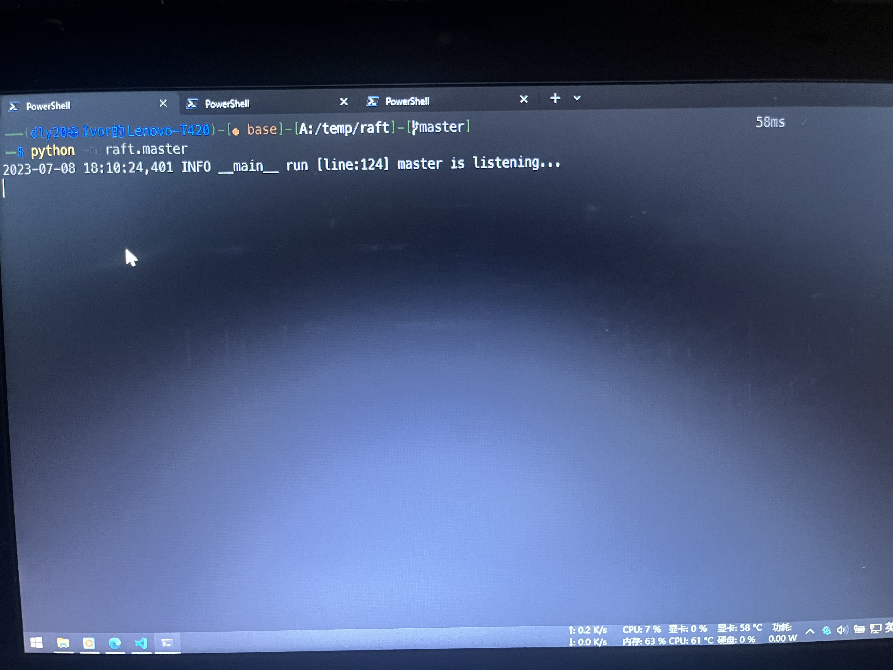
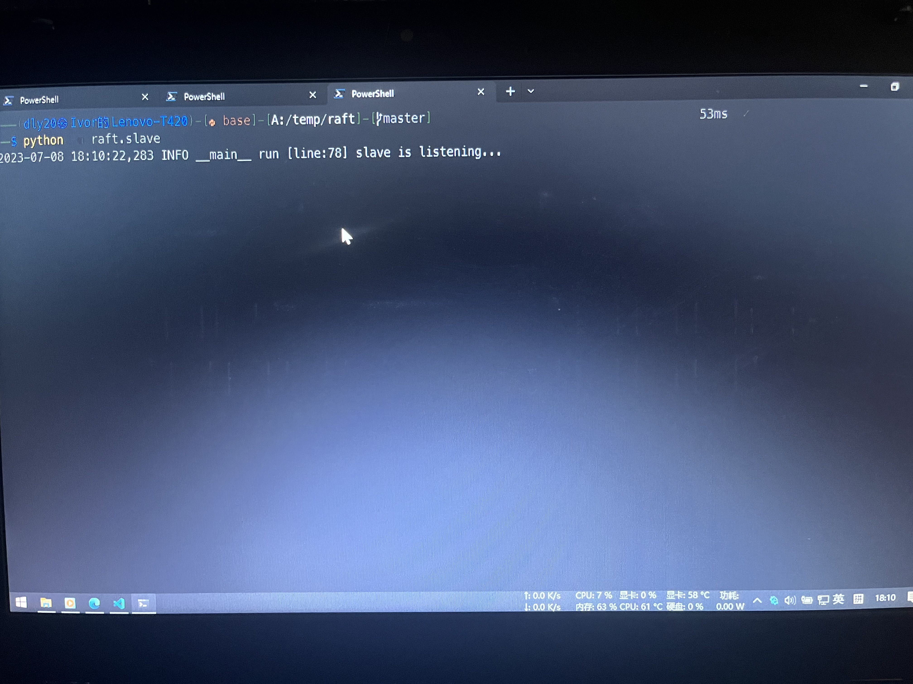
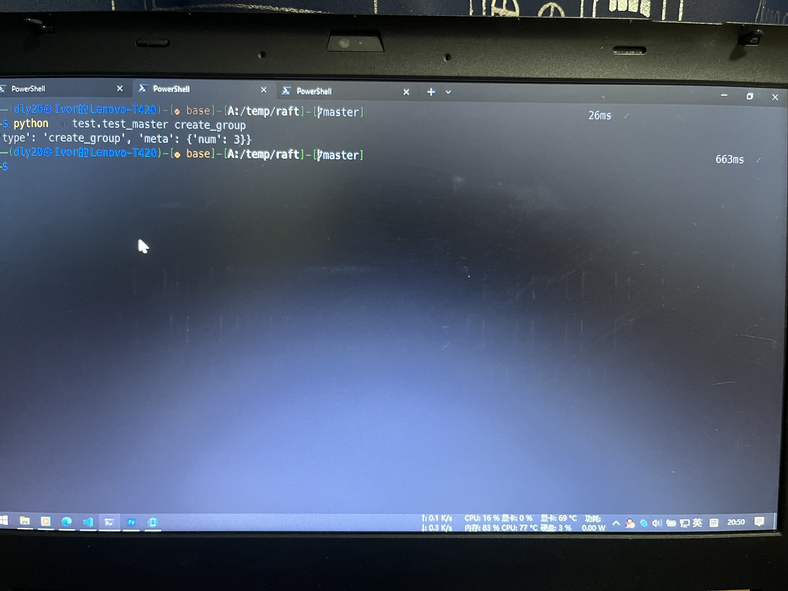
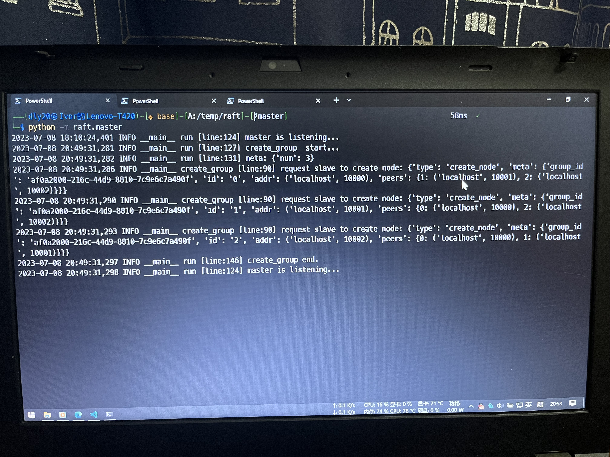
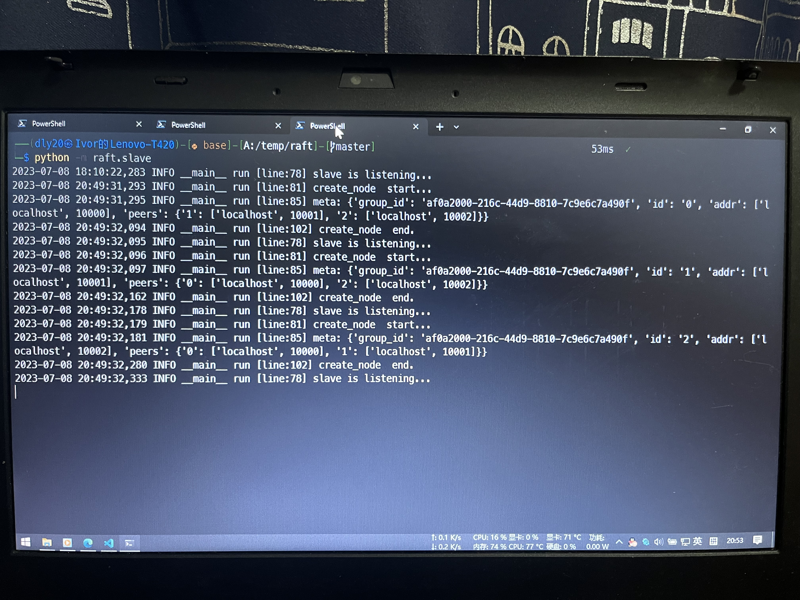
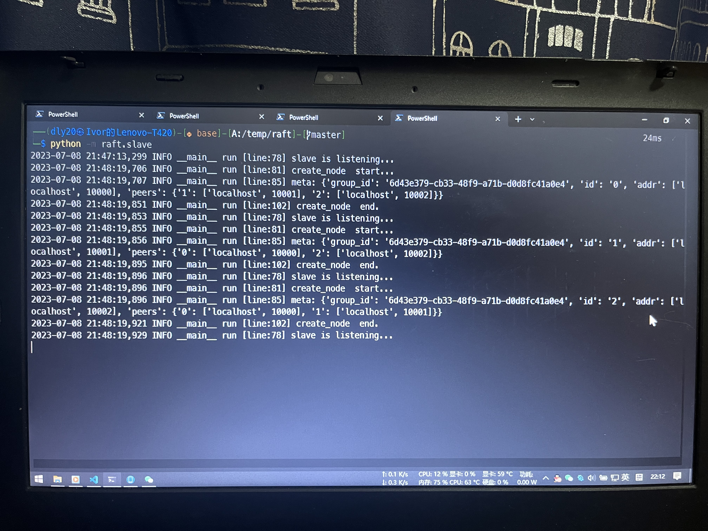
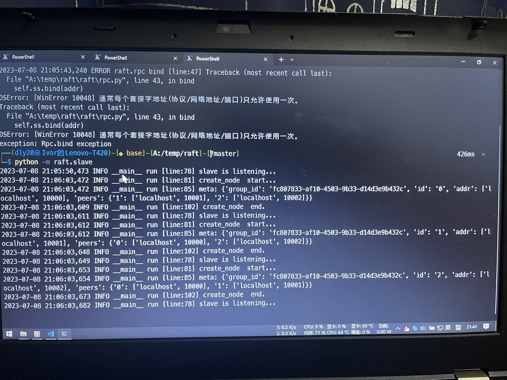

|课程名称：大数据分布式计算|学期：2023春|成绩：|
|-|-|-|
|指导教师：李青泽|学生姓名：邓力予|学生学号：20201910442|
|实验名称：Raft|
|学院：数学与统计学院|专业：数据科学与大数据技术|年级：2020级|

# 简述

开源项目 https://github.com/hangsz/raft 使用 Python 实现了 Raft

## 文件说明

- node.py, log.py为raft核心代码
- node.py 实现raft的节点消息收发、角色转换等功能
- log.py 实现具体的日志存储
- rpc.py 实现具体消息编码和转发
- master.py 控制面中心节点, 进行group创建和管理
- slave.py 每个server上部署的控制面节点

## 使用方法

1. python -m raft.master, 启动master节点

2. python -m raft.slave, 启动slave节点

3. python -m test.test_master \<选项\>

    选项：

    - create_group, create一个raft group

    - stop_group, 安全终止 一个raft group

    - stop_master, 安全终止master

4. python -m test.test_slave stop_slave

5. python -m test.client, 用户写入log

## 结果说明
- data/master, master存储的数据
- data/slvae, slave存储的数据
- data/node 
    - .log 各node交互过程监控数据, 可以在git bash中用tail -f filename.log查看
    - persistent.json, node持久化数据
    - log.json, 存储的日志

# 实验过程与结果

我们先启动 Master 和 Slave，分别在两个终端中执行

`python -m raft.master`

`python -m raft.slave`

然后我们再创建组，是使得 Master 和 Slave 在同一组。

在新终端中执行：`python -m test.test_master create_group`

此时 Master 输出

Slave 输出

## PART 2A

## PART 2B

我们尝试新启动一个终端，并启动一个 Slave，可以看到 Slave 顺利加入到了 Group 并接收到了日志。

## PART 2C

我们尝试终端 Slave 并重新启动，可以看到 Slave 顺利重新加入 Group 中并重新接收 Log。

